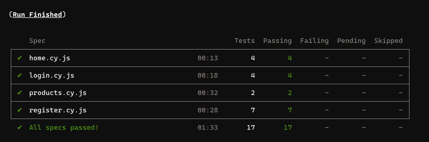
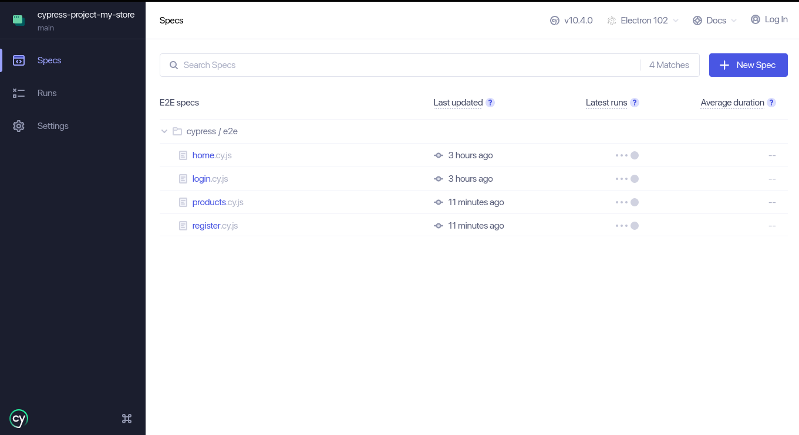
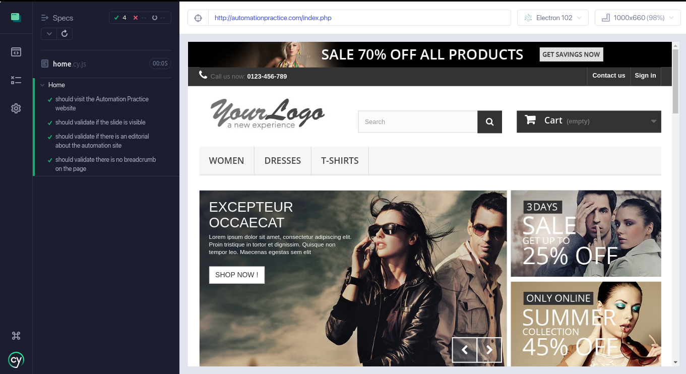

# Automation Testing using Cypress

Repository created with the purpose to storing the project used during the training of the cypress created by iLAB. Also store my steps using git history.

## About

**Cypress** is a next generation front end testing tool built for the modern web. They address the key pain points developers and QA engineers face when testing modern applications. The final training project is to create some test cases for the [My Store page](http://automationpractice.com/index.php). A common site used for automation testing courses.

### Challenge goals

- [x] Register in website
- [x] Buy 3 products
- [x] Change product quantity in shopping car.

## Dependencies used

- cypress
- cypress-xpath
- prettier
- eslint
- cypress-real-events
- @faker-js/faker

## Pre-requirements

To run this project, you will need:

- [git](https://git-scm.com/downloads) (I've used version `2.34.1` while writing this doc)
- [nodejs](https://nodejs.org/en/) (I've used version `v16.15.1` while writing this doc)
- NPM (I've used version `8.11.0` while writing this doc)

**Note:** When installing nodejs, NPM is automatically installed too.

## Installation

1. Clone the repository
2. Access the project folder
3. Run `npm install` (or `npm i` for the short version) to install the dev dependencies.

### Configuring the environment variables

Before running the tests, some environment variables need to be set up.

Make a copy of the [`cypress.env.example.json`](./cypress.env.example.json) file as `cypress.env.json`, and set the appropriate values for all the variables.

**Note:** `cypress.env.json` file is not tracked by git.

## Tests

In this project, you can run tests in interactive and headless modes

### Headless mode

Run `npm test` (or `npm t` for the short version) to run the test in headless mode.

Run `npm run cy:browser` + `name of browser` to run the test in headless mode om your preferred browser.

The test results should look like the below image.

### Interactive mode

Or, run `npm run cy:open` to open Cypress in interactive mode.

